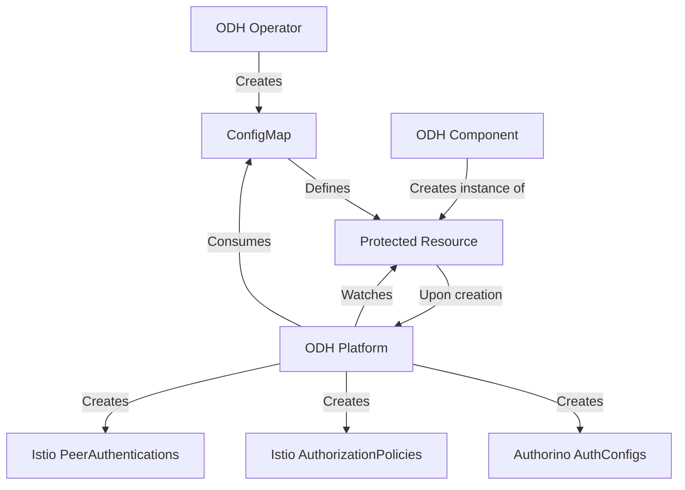
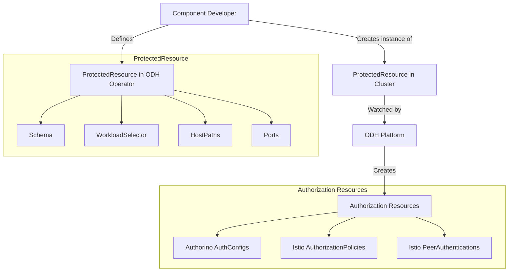

# ODH Platform

## Usage

### General flow diagram:



The platform controller is deployed on the cluster automatically whenever a DSC component that indicates that it requires authorization is enabled.

### From the component developer perspective:


The developer needs to define the ProtectedResource in the ODH operator in order for the ODH platform controller to watch for the resources intended to be protected.
The ProtectedResource type looks like:
```go
type ProtectedResource struct {
Schema ResourceSchema json:"schema,omitempty"
WorkloadSelector map[string]string json:"workloadSelector,omitempty"
HostPaths []string json:"hostPaths,omitempty"
Ports []string json:"ports,omitempty"
}
```

Where Schema is a custom type:
```go
type ResourceSchema struct {
// GroupVersionKind specifies the group, version, and kind of the resource.
schema.GroupVersionKind `json:"gvk,omitempty"`
// Resources is the type of resource being protected, e.g., "pods", "services".
Resources string `json:"resources,omitempty"`
}
```